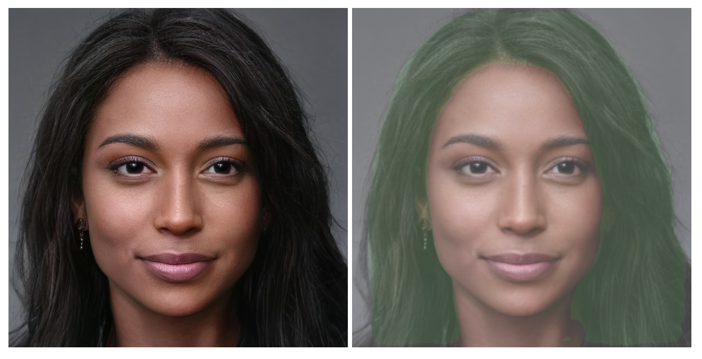

# README

### This is a neural network based implementation for solving the hair segmentation on selfie cameras

### Details
- Architecture: Modified U-Net based implemented with keras
- Training platform: Google colab T4 GPU
- Deployment Backend: Tensorflow JS on browser via webgl
- Input dataset: Sampled images from CelebA dataset and generated segmentation masks
- Execution speed: ~10 video frames per second

### Relevant files:
- hair_segmentation.ipynb:- training script
- demo-app:- webapp for predicting on webcam & image data
- dataset:- data preparation scripts
- converter.sh:- Tensorflow to TFJS model format converter

### Results on images:

prediction time: ~40ms
